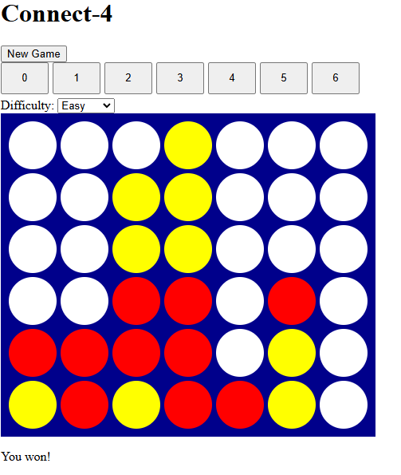

# Connect-4
A Connect-4 engine with an AI opponent using minimax and alpha-beta pruning, plus a playable web interface.

## Overview
This project implements a complete Connect-4 game with an AI opponent built from classical search algorithms rather than a pre-trained model or external API. The core engine handles board state, legal move generation, and win/draw detection, while the AI uses minimax search with alpha-beta pruning and move ordering to choose strong moves efficiently. A web interface lets a human play against the AI at adjustable difficulty.

## Demo


## Features
- [x] Full Connect-4 rules engine (move validation, win/draw detection)
- [x] Minimax AI with adjustable search depth
- [x] Alpha-beta pruning for faster search
- [x] Move ordering to improve pruning efficiency
- [ ] Transposition table to cache evaluated positions
- [x] Web interface to play against the AI
- [x] Difficulty selector (tied to search depth)

## Tech stack
- Python (game engine, AI logic)
- Flask (backend)
- HTML/CSS/JavaScript (frontend)

## Search performance
Move ordering (searching centre columns first) reduced search time at depth 6 from approximately 1.5 seconds to approximately 0.2 seconds — roughly a 7-8x speedup — with no change to the move chosen.

## Installation
```bash
git clone https://github.com/Karthik-natarajan06/connect-4.git
cd connect-4
pip install -r requirements.txt
python app.py
```
Then open `http://localhost:5000` in your browser.

## What I'd improve with more time
- Add a transposition table to cache previously evaluated positions and reduce redundant search.
- Make "Easy" mode weaker through a more deliberate difficulty curve, rather than relying on occasional random moves.

## License
MIT
